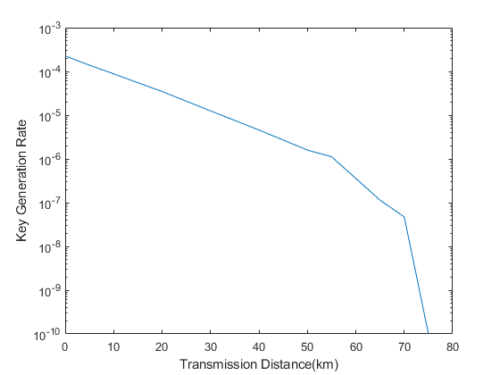

# 诱骗态量子密钥分发协议的数据处理方法

这是毕业设计论文《诱骗态量子密钥分发协议的数据处理方法》中所使用的的代码部分。代码分为用于BB84的仿真代码和用于MDI-QKD的仿真代码两部分，分别存放在/BB84和/MDIQKD文件夹下，而部分仿真结果则放在/Results文件夹下。

## BB84

* 要执行BB84仿真，请运行/BB84/Decoy_Simulate_BB84.m文件，其中包含有系统参数的设置，请按照注释进行修改。默认情况下代码将遍历$10km-140km$的传输距离并给出相应的安全码率曲线，如下图所示

  

* 如果不进行仿真而直接输入实验测试数据计算相应的安全码率，请运行/BB84/evaluate_R.m文件，相关的参数设置和实验数据的输入请参考文件内注释。

## MDI-QKD

* 要执行MDI-QKD的仿真，请运行/MDIQKD/MDI_Decoy_Simulate.m文件，其中包含有系统参数的设置，请按照注释进行修改。注意，为了加快MDI-QKD仿真进程的运行，代码中使用了多线程的方式，如果要修改线程数，请修改变量`core_num`，如果将其设置为1则不使用多线程，该参数不能大于运行计算机的CPU数量。

* 如果不进行仿真而直接输入实验测试数据计算相应的安全码率，请运行/MDIQKD/evaluate_R.m文件，相关的参数设置和实验数据的输入请参考文件内注释。

* 如果要绘制安全码率-传输距离曲线，请运行/MDIQKD/mdiqkd_plot.m文件，其中加载的数据文件已经放置在/Results中，运行时注意将存放数据的文件放置到与代码同一目录下。结果如下图所示

  

  

  

